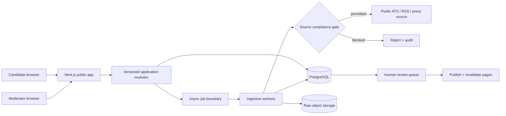

# Architecture

## Module boundaries

- Identity and permissions
- Companies, legal entities, GCCs, offices, and cities
- Events and timelines
- Sources, snapshots, evidence, and confidence
- Jobs and historical observations
- Search and discovery
- Saves, alerts, and notification preferences
- Contributions and moderation
- Audit and observability

Writes cross a module boundary through application services, not direct table mutation. Ingestion produces proposed facts; only reviewed/policy-approved facts become public.

## Primary request path

Public directory and profile reads use server-rendered pages backed by cacheable application queries. Query parameters are canonical filter state. The initial fixtures will be replaced by PostgreSQL repositories without changing component or HTTP contracts.
