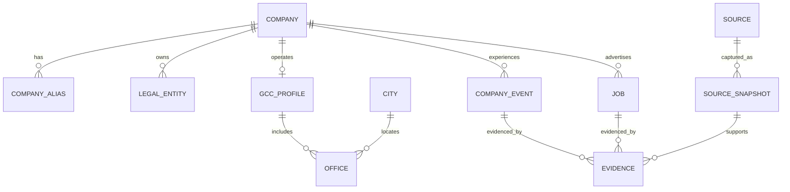

# Data Model

## Identity hierarchy

## Invariants

- Parent company, Indian legal entity, GCC profile, and office are distinct.
- Aliases do not replace canonical identifiers.
- Each material public field has at least one evidence edge.
- Jobs are immutable identities with mutable observations; closure never deletes history.
- Entity merges are reversible and audited.
- Public records use soft lifecycle states: draft, review, published, superseded, withdrawn.

See `infra/postgres/migrations/0001_core.sql` for the first executable schema.

## Post-MVP entities

Salary/offer/interview submissions, role and level taxonomies, benefits, workplace policies, employer claims, and B2B access remain outside migration 0001. They will be added only with approved privacy, retention, and moderation rules.
