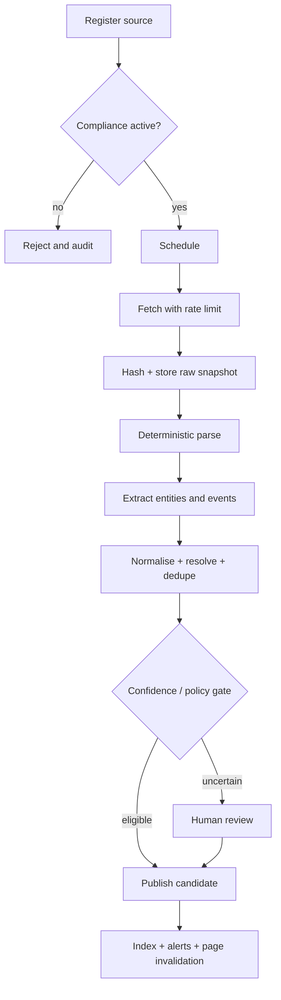

# Ingestion

## First adapters

1. Greenhouse public job board API/feed.
2. Company RSS or press-release feed.

Automated tests use recorded fixtures, never live sources. Each adapter implements a permit check, conditional fetch, timeout, retry budget, content-size limit, parser version, stable content hash, and source-specific freshness policy.

## Safety

- No anti-bot bypass or unauthorised LinkedIn scraping.
- External text cannot change system instructions or schema.
- LLM extraction, when later enabled, records model/prompt version and returns a strict validated object.
- Unsupported or conflicting facts enter review rather than public output.
- Dead-letter records retain error category and retry history without silently dropping data.
